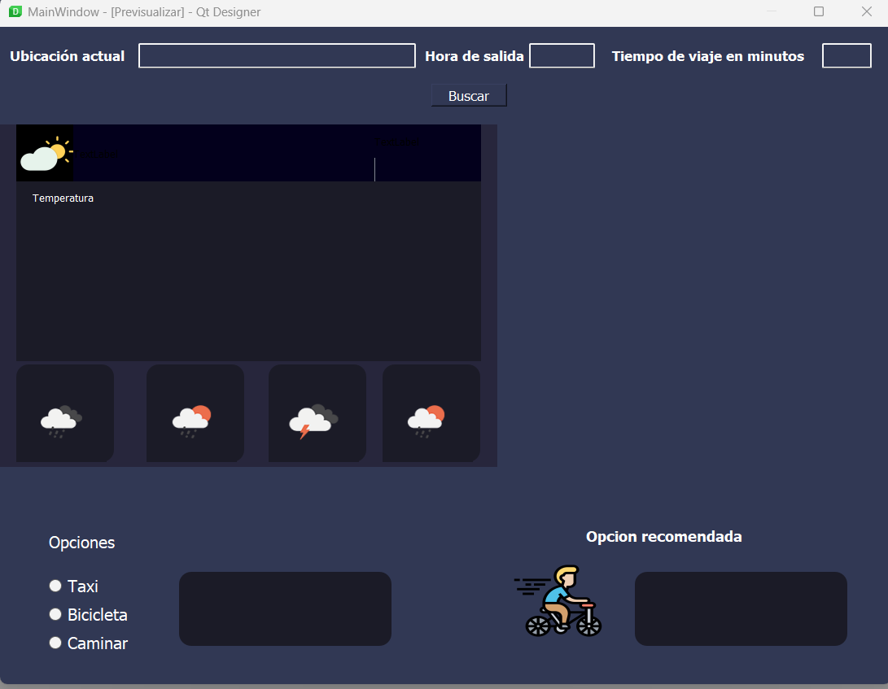

# Planificador de viajes
> Proyecto Final - PYTHON INTERMEDIO C46833 OCT. 2022 - FEB. 2023

## Objetivos de aprendizaje
- Aplicar nuevas habilidades a un problema del mundo real
- Sintetizar las técnicas aprendidas

## Herramientas
- folium==0.14.0
- geopy==2.3.0
- matplotlib==3.6.2
- numpy==1.23.5
- pandas==1.4.4
- Pillow==9.4.0
- PyQt5==5.15.8
- python_dateutil==2.8.2
- requests==2.28.1
 
## Organización de carpetas

```
├── main.py                 # Archivo principal
├── src                     # Archivos fuentes
│   ├── Mapquest.py         # Pre proceso de datos del mapa clase
│   ├── weather.py          # Pre proceso de datos del clima clase
│   └── proyectofinal       # Pre procesao de datos archivo jupyter
├── gui                     # Archivos de GUI
│   ├── Gui.ui              # Diseño de ventana principal
│   ├── geckodriver.exe     # sirve para convertir el mapa de folium en png
├── img                     # iconos e imagenes
│   ├── 01d@2x.png
│   ├── 01n@2x.png
│   ├── 02d@2x.png  
│   ├── 02n@2x.png
│   ├── 03d@2x.png
│   ├── 03n@2x.png
│   ├── 04d@2x.png
│   ├── 04n@2x.png
│   ├── 09d@2x.png
│   ├── 09n@2x.png
│   ├── 10d@2x.png
│   ├── 10n@2x.png
│   ├── 11d@2x.png
│   ├── 11n@2x.png
│   ├── 13d@2x.png
│   ├── 13n@2x.png
│   ├── 50d@2x.png
│   ├── 50n@2x.png
│   ├── demostracion.png
│   ├── images.png
│   └── prototipo.png
└── 
```


## Descripción

Planificador de viajes es una aplicación desarrollada en Python que nos muestra el clima y nos permite obtener una ruta personalizada y optimizada dependiendo de el tipo de transporte que nosotros queramos utilizar.
En base a esto nos da una recomendacion cual seria el transporte que trendriamos que elegir para poder llegar a nuestro destino de manera satisfactoria, esta decision la toma en base en las condiciones climatologicas existentes, el tiempo de viaje que dispongo y la distancia que hay entre mi ubicacion y mi destino.

A continuación se muestra la ventana principal de la aplicación. 
 

<div align="center">

</div>
<br>
<br>
<br>
<div align="center">
<a href="https://youtu.be/W_IQ4EbTPRk" target="_blank">

</a>
<p>Demostración de funcionamiento</p>
</div>


<br/><br/>
